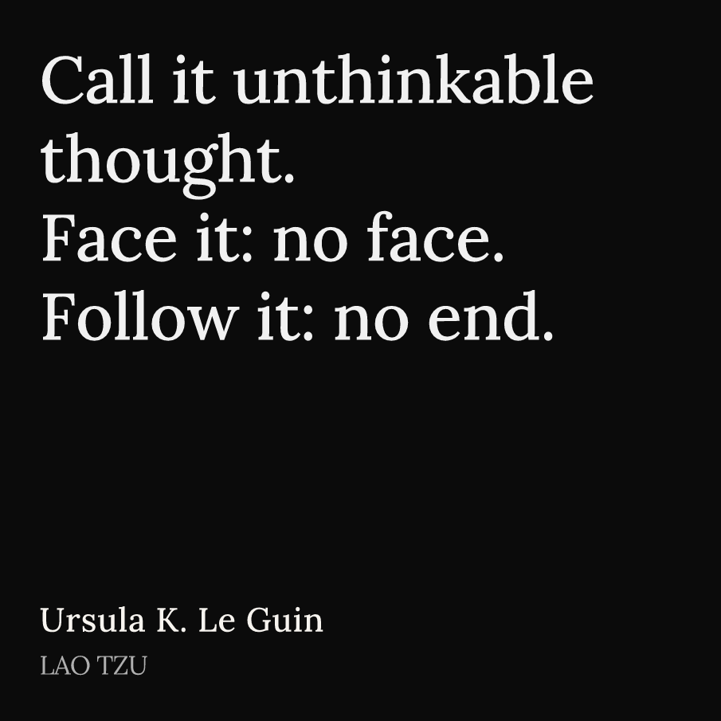

# Telegram Highlights Plugin for KOReader

Send book highlights and screenshots from KOReader to a Telegram bot [@bookshotsbot](https://t.me/bookshotsbot) with ease. Select text or use existing highlights, then send or save-and-send to the bot.

## Features

- Send selected text or existing highlights to @bookshotsbot.
- **Send to Bot**: Sends text with image quote.
- **Save & Send**: Saves the highlight and sends image quote.
- **Upload all your bookmarks of a book to cloud**:
  - Bulk send all your bookmarks at once
  - Delete duplicates on the miniapp with one click
  - Send bookmarks individually
- **Auto turn on and turn off Wi-Fi after sending** (may not work on Android-based e-readers):
  - Toggle this feature in the plugin’s settings
- **Send screenshots to bot**

## Requirements

- KOReader on your e-reader
- Telegram account
- Wi-Fi for sending highlights

## Install

1. Download the latest plugin release:

   👉 [Download from Releases](https://github.com/0xmiki/telegramhighlights.koplugin/releases/latest)

2. Unzip the downloaded `telegramhighlights.koplugin.zip` — inside you will find a folder named `telegramhighlights.koplugin`.

3. Copy the `telegramhighlights.koplugin` folder to KOReader’s `plugins` directory.

4. Restart KOReader. The plugin will appear under **Tools > Telegram Highlights**.

## How to Use

### 1. Get a Code

- Chat with [@bookshotsbot](https://t.me/bookshotsbot) on Telegram to receive a verification code.
- In KOReader: go to `Tools > Telegram Highlights > Set verification code`, enter your code, and save.

### 2. Send Highlights

- **New Text**: Select text → open highlight menu → choose **Send to Bot** or **Save & Send**.
- **Existing Highlight**: Tap a highlight → press the three dots → choose **Send to Bot** or **Save & Send**.

### 3. Bulk Send Bookmarks

- Open the book with the bookmarks
- Go to the bookmark icon or main menu → Bookmarks
- Tap the menu icon (top-left) → **Send all to Bot**

### 4. Send Individual Bookmarks

- Open the bookmarks page
- Long-press a bookmark → tap **Send to Bot**

### 5. Send Screenshots

- Swipe diagonally on your Kindle
- In the dialog, tap **Send to Bot**

### 6. Customize Quote Images

- In the miniapp, tap the **Customize** button under the quote image
- Launch the miniapp from the **Highlights** screen → tap the image icon under the quote
- Customize:
  - Colors
  - Unsplash presets
  - Search for any Unsplash image as background

## Examples

**Raw Highlight:**

**Customized in Miniapp:**

## About the Bot

The bot is hosted on [Deno Deploy](https://deno.com/deploy) and uses Deno’s key-value store to manage user preferences and IDs.

---

Have questions or feature requests?  
Feel free to open an issue or message the author on Telegram: [@mikxyas](https://t.me/mikxyas)
